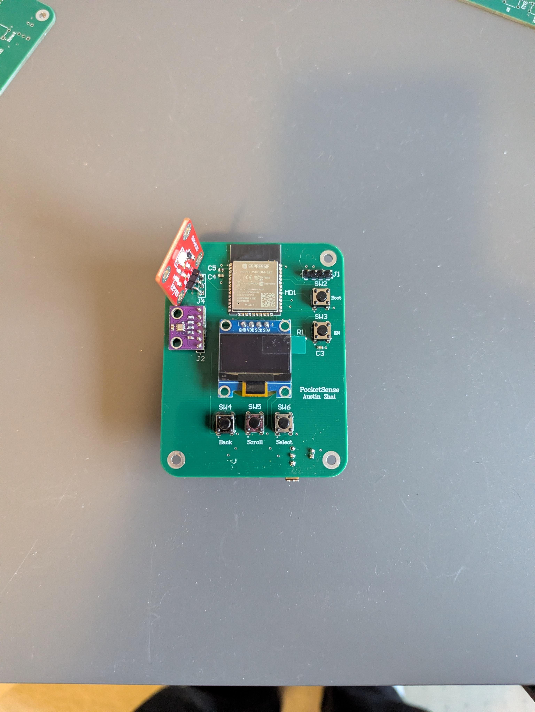
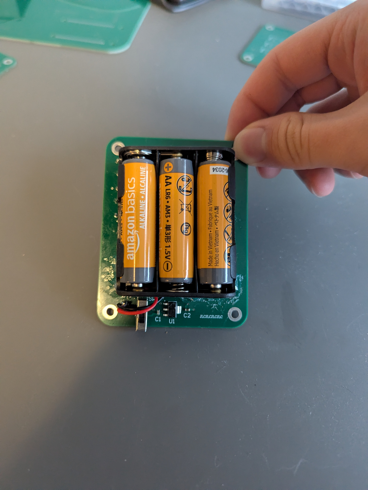
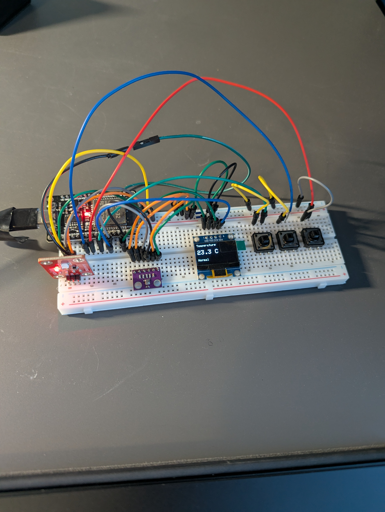
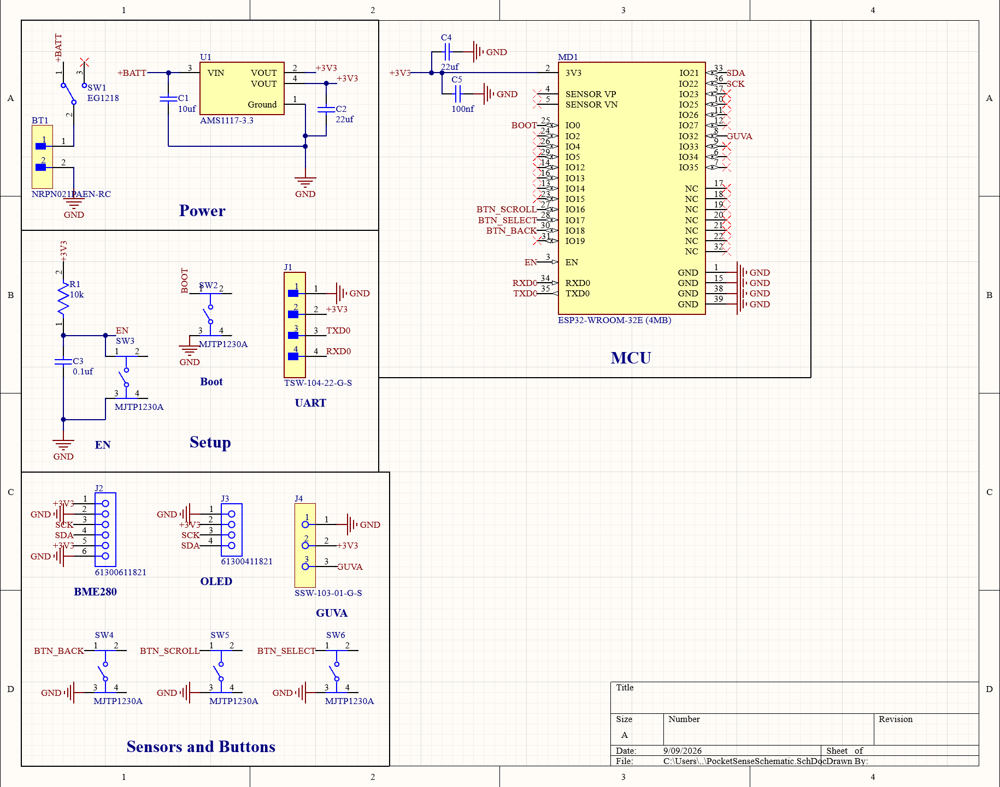
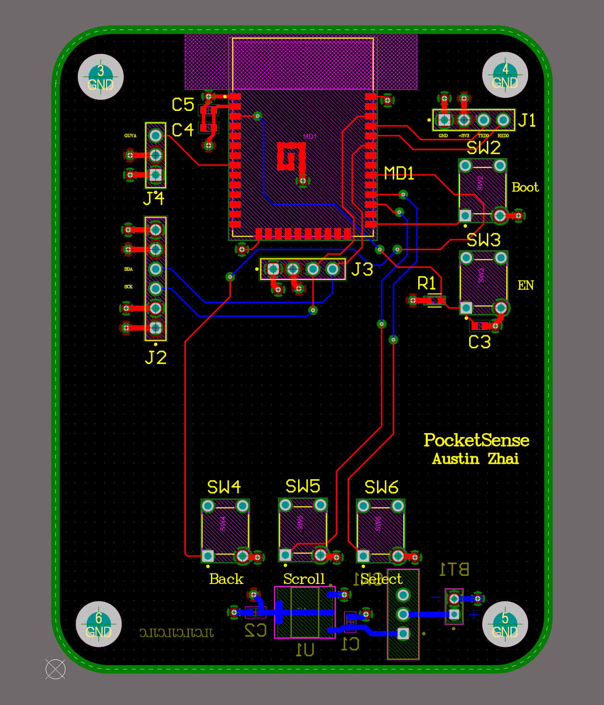
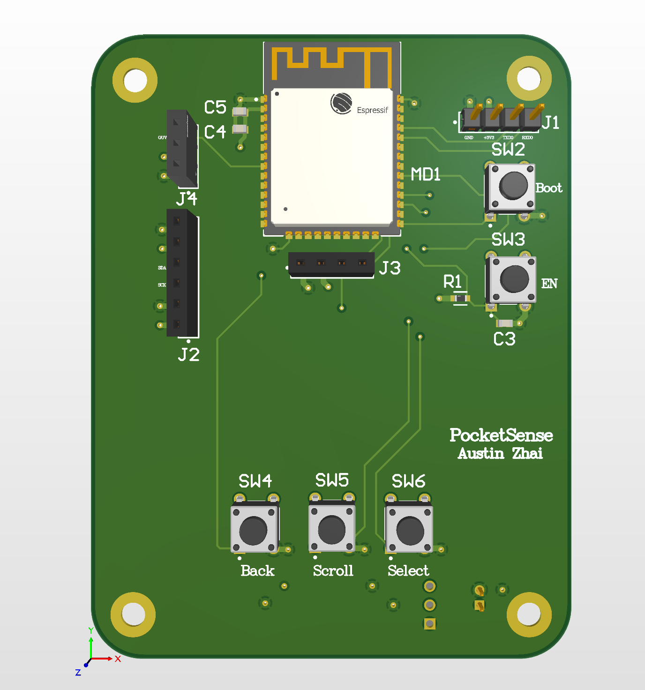
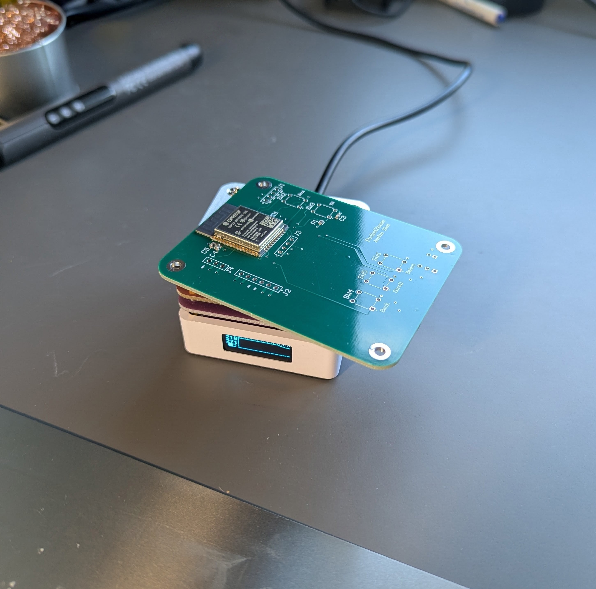
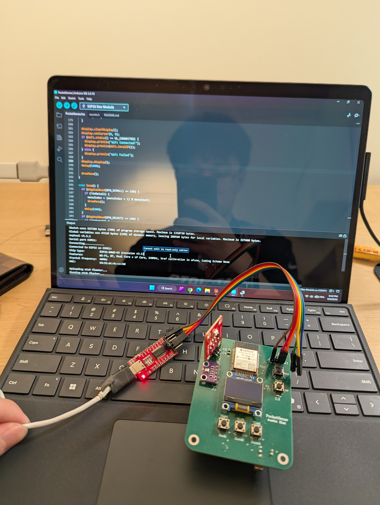

# PocketSense

A pocket-sized ambient room monitor built on a custom four-layer PCB around an ESP32-WROOM-32E. Temperature, humidity, pressure, UV index, and WiFi signal strength, all on a 0.96" OLED, navigated with three buttons, running off three AA batteries.

<p align="center">
  
  
  
  
  
  
</p>

<p align="center">
  
  
</p>

<p align="center"><i>Final assembled board, front and back.</i></p>

---

## What it does

PocketSense is a self-contained environment monitor. Power it on and it connects to WiFi, then drops you into a five-item menu:

| Screen | Sensor | Reading |
|---|---|---|
| Temperature | BME280 | °C, with Cold / Normal / Hot classification |
| Humidity | BME280 | %RH, with Dry / Normal / Humid classification |
| Pressure | BME280 | hPa, with Low / Normal / High classification |
| UV | GUVA-S12SD | UV index, with None through Very High classification |
| WiFi | ESP32 radio | SSID, RSSI in dBm, IP address, signal quality |

Three tactile buttons drive the whole UI: **SCROLL** moves down the menu, **SELECT** opens a detail screen, **BACK** exits the detail screen (or scrolls up when you're already in the menu). No phone, no app, no cloud. Everything renders on-device.

---

## Repository layout

```
PocketSense/
├── firmware/
│   └── PocketSense/
│       ├── PocketSense.ino      Complete firmware sketch
│       └── secrets.h.example    Template, copy to secrets.h
├── images/
│   ├── hardware/                Schematic, PCB layout, 3D render
│   └── build/                   Prototype, assembly, bring-up, final board
└── README.md
```

The sketch lives in `firmware/PocketSense/` because the Arduino IDE requires a `.ino` to sit inside a folder of the same name. Open that folder directly in the IDE.

---

## The walkthrough

This project went breadboard, then schematic, then PCB, then fabrication, then bring-up. Each stage is below.

---

### 1. Breadboard prototype



Nothing gets designed into copper until it works on a breadboard first. The entire firmware was written and validated here, on an ESP32 DevKit, before a single schematic symbol was placed.

What got proven at this stage:

- **Shared I2C bus.** The BME280 (address `0x77`) and the SSD1306 OLED (address `0x3C`) both hang off IO21/IO22. Different addresses, one bus, two devices. This is the thing you want to confirm early, because a bus conflict on a fabbed board is not something you can fix with a jumper wire.
- **UV sensing on ADC1.** The GUVA-S12SD outputs an analog voltage that maps to UV index at roughly 100 mV per index unit. It lives on **IO32** specifically: IO32 is on ADC1, which stays usable while the WiFi radio is active (ADC2 does not), and unlike IO34/35/36 it isn't input-only.
- **Button handling.** Three momentary buttons on IO16/17/18, all `INPUT_PULLUP`, with a simple 200 ms delay for debounce. Crude, but it's a menu. It doesn't need an interrupt-driven state machine.
- **Menu state machine.** A `menuIndex` plus an `inDetail` flag is the entire UI model. `drawMenu()` renders the list with a `>` cursor, and `drawDetail(index)` renders one sensor full-screen at text size 2 with a status line underneath.

Once all five screens rendered correctly and the sensors read sane values, the pin assignment was frozen and schematic capture began.

**Final pin assignment** (firmware and hardware match exactly):

| Signal | GPIO |
|---|---|
| SDA (BME280 + OLED) | IO21 |
| SCL (BME280 + OLED) | IO22 |
| GUVA UV analog | IO32 |
| BTN_SCROLL | IO16 |
| BTN_SELECT | IO17 |
| BTN_BACK | IO18 |
| Boot | IO0 (button to GND) |
| Reset | EN (10k pullup + 1 µF cap + button to GND) |
| UART | TXD0 / RXD0 |

---

### 2. Schematic capture



Drawn in Altium Designer. Four functional blocks:

**Power.** 3x AA (4.5 V nominal) into an SPDT slide switch on the positive rail, into an AMS1117-3.3 LDO (SOT-223, fixed 3.3 V output), out to the 3V3 rail. 10 µF on the input, 22 µF on the output. The switch breaks `+BATT` rather than GND, so the whole board is genuinely dead when it's off.

**EN / reset circuit.** The ESP32's EN pin needs a clean, slow rise on power-up or the module won't come out of reset reliably. That's a 10 kΩ pullup to 3V3 and a 1 µF capacitor to GND, with the reset button in parallel with the cap. Espressif recommends 1 to 10 µF here, and 1 µF was chosen.

**Boot circuit.** IO0 to GND through a momentary button. No external pulldown, since the ESP32 has an internal pullup and the button alone is enough to drop it low at reset and enter the bootloader.

**Programming header.** A 4-pin GND / 3V3 / RXD0 / TXD0 header. TX and RX are deliberately crossed in the wiring: the converter's TX goes to the board's RXD0, and the converter's RX goes to the board's TXD0.

> **The bug that almost shipped:** BTN_SELECT and BTN_BACK were originally wired to *physical pins* 17 and 18 on the ESP32 module symbol. Those are internal SPI-flash / NC pins, not GPIO 17 and 18. Physical pin numbers on the module edge have nothing to do with GPIO numbers. Caught it by cross-referencing the WROOM-32E datasheet pin table line by line before the PCB push. This is now a permanent habit: never trust a module symbol's pin numbering, always check the table.

---

### 3. PCB layout



Four-layer stackup:

| Layer | Type | Purpose |
|---|---|---|
| Top | Signal | Component placement + routing |
| Layer 2 | Plane | Solid GND |
| Layer 3 | Plane | Power |
| Bottom | Signal | Routing |

Going four-layer on a board this simple isn't strictly necessary, but a dedicated ground plane makes the ESP32's return paths clean and gives the RF section something sane to reference against. The practice of building a proper stackup was part of the point.

Passives are SMD throughout: 0603 for resistors and small capacitors, 0805 for the 10 µF and 22 µF bulk caps.

**Antenna keepout.** The ESP32-WROOM's PCB antenna needs clear space or the WiFi range craters. A 2 mm keepout was placed around the antenna region with no copper on *any* layer. Worth noting: in Altium, a keepout region only blocks routing on signal layers, and internal plane copper doesn't respect it automatically. Voiding the planes under the antenna required placing Fill objects directly on the plane layers.



Altium's 3D view, used as the last sanity check before export: component collisions, connector clearance, whether the OLED actually fits where it's supposed to. DRC passed at zero violations, and the Gerbers were loaded into JLCPCB's online viewer to confirm the negative-plane layers were interpreted correctly before ordering.

---

### 4. Assembly



Boards arrived from JLCPCB. SMD work first, since it's easier to place small parts on a flat board with nothing tall in the way:

- AMS1117-3.3 LDO (SOT-223)
- 10 µF input cap, 22 µF output cap (0805)
- EN circuit: 10 kΩ pullup + 1 µF cap
- Slide switch
- Remaining 0603 passives

**Switch mismatch.** The switch that arrived was SP3T, meaning 3 positions and 4 electrical pins plus 2 mounting tabs, while the footprint was drawn for a 3-pin SPDT. Rather than reorder, continuity testing sorted it out: probing the pins with a multimeter confirmed that 3 of the 4 electrical pins line up with the 3 PCB holes, and that the middle pin beeps against pin 3 in the ON position and goes open in the others. The unused pin and the mounting tabs are left hanging. Not elegant, but electrically correct and verified.

**Pre-power checks.** Before applying any voltage: a continuity probe between the 3V3 pad and GND. No beep, no short, safe to power up. Then the switch was toggled through its positions with the meter to confirm the mapping above.

Still to be soldered: the ESP32 module, the three tactile buttons, the BME280, the GUVA-S12SD, and the OLED.

---

### 5. UART bring-up



An FT232R USB-to-UART converter handles programming. Two things to get right:

1. **Drivers.** The FTDI VCP driver from [ftdichip.com/drivers/vcp-drivers](https://ftdichip.com/drivers/vcp-drivers/). If no COM port appears after installing, open Device Manager, right-click "USB Serial Converter", then Properties, Advanced, tick **Load VCP**, then unplug and replug. It enumerated as COM11.
2. **Do not dual-power.** The board is powered from its own batteries. The converter's 3V3 pin stays disconnected, since back-feeding the LDO output while the LDO is also driving it is a good way to damage one or both.

**Boot sequence for flashing.** The ESP32 has no auto-reset circuit on this board, so entry into the bootloader is manual and the timing matters:

1. Switch on (battery power)
2. Plug in the UART converter
3. Arduino IDE, set to ESP32 Dev Module, COM11, 115200 baud
4. Hit Upload
5. Wait for `Connecting......` to appear
6. **At that exact moment:** hold BOOT, tap EN/RESET, release BOOT
7. esptool connects and begins flashing

Do it before `Connecting......` shows up and the window is missed. Upload speed was dropped from 921600 to 115200 to widen the margin.

---

## Where it stands

The board is alive and talking. Over UART, esptool successfully identifies the chip:

```
Chip is ESP32-D0WD-V3 (revision v3.1)
MAC: 94:51:dc:4c:cc:b8
Stub flasher running.
```

Detection, handshake, and stub upload all work, which means the EN circuit, the boot circuit, the UART routing, the crossed TX/RX, and the LDO are all doing their jobs. The design is validated end to end on the electrical side.

Flashing then stops here:

```
A fatal error occurred: No more data to read from the serial port.
```

**Cause: battery voltage sag, not a design fault.** Measuring across the AMS1117-3.3's output with a multimeter shows **~3.0 V**, not 3.3 V. The AMS1117 has roughly a 1.3 V dropout, so with 3x AA at 4.5 V nominal the input barely clears that margin to begin with, and the AA cells on hand are already partly drained. The moment the stub flasher starts executing and the ESP32's current draw spikes toward its ~500 mA peak, the cells sag, the regulator falls out of regulation, and the module browns out mid-transfer. The serial port goes quiet because the chip on the other end just reset.

The fix is a supply problem, not a layout problem:

- Power from a regulated 4.5 to 5 V bench supply during programming, or
- Fresh alkaline AAs with real headroom

**Remaining steps once flashing completes:**

1. Confirm the 3V3 rail holds 3.25 to 3.35 V with the ESP32 running
2. Solder the BME280 and verify I2C at `0x77`
3. Solder the OLED and verify I2C at `0x3C` and rendering
4. Solder the GUVA and verify the ADC reading on IO32
5. Solder the three tactile buttons and verify menu navigation
6. Full functional test with all five screens live

Everything up to the flash has been verified with a meter or with esptool's own output. The remaining work is bring-up, not redesign.

---

## Firmware

Single sketch: [`firmware/PocketSense/PocketSense.ino`](firmware/PocketSense/PocketSense.ino).

**Libraries:** `Wire`, `WiFi`, `Adafruit_GFX`, `Adafruit_SSD1306`, `Adafruit_Sensor`, `Adafruit_BME280`. ESP32 Arduino core 3.x.

**Credentials:** copy `secrets.h.example` to `secrets.h` in the same folder and fill it in. `secrets.h` is gitignored and never committed.

```cpp
#define WIFI_SSID     "your-network"
#define WIFI_PASSWORD "your-password"
```

**Board settings:** ESP32 Dev Module, 115200 upload speed. If flashing fails on QIO flash mode, try DIO.

**UV index math:** the GUVA's analog output is converted with

```cpp
float voltage_mV = (analogRead(GUVA_PIN) / 4095.0) * 3.3 * 1000;
float uvIndex    = voltage_mV / 100.0;
```

which is roughly 100 mV per UV index unit, clamped at zero.

---

## Things learned

- **Module pin numbers lie.** Physical pin 17 on a WROOM-32E is not GPIO17. Cross-reference the datasheet pin table every single time.
- **Internal planes are their own layer type.** In Altium, planes have to be set to type `Plane` in the Layer Stack Manager and assigned nets via the Split Plane dialog. Keepout regions won't void them either, which takes Fill objects placed directly on the plane layer.
- **Verify Gerbers in the fab's own viewer.** Negative-plane rendering is exactly the kind of thing that looks fine locally and comes back wrong.
- **Regulator dropout is a real design constraint.** An AMS1117 with a 1.3 V dropout and a 4.5 V nominal battery pack has almost no margin. Under a WiFi current burst, "almost no margin" becomes "no margin." A low-dropout part, or a fourth cell, would have made this a non-issue.
- **Prototype first, always.** Every firmware bug was found on the breadboard, where fixing one costs a jumper wire instead of a two-week fab turnaround.

---

Built by [Austin Zhai](https://github.com/AustinZhai8), Computer Engineering, UBC.
